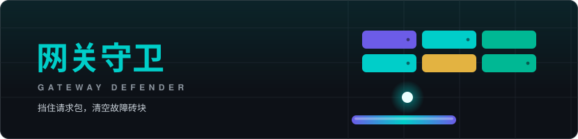

<!-- ==================== 顶部动效头图 ==================== -->

<!-- ==================== 打字机 ==================== -->

 

<!-- ==================== 徽章 ==================== -->

  
  
  

---

## 技术栈 · Tech Stack

**Languages**

**Frontend**

**Desktop & Backend**

**Infra & Tools**

---

## 数据面板 · GitHub Stats

 

 

---

## 贡献动画 · Contribution Arcade

<picture>
  <source media="(prefers-color-scheme: dark)" srcset="https://raw.githubusercontent.com/Aerial2/Aerial2/output/github-contribution-grid-snake-dark.svg" />
  <source media="(prefers-color-scheme: light)" srcset="https://raw.githubusercontent.com/Aerial2/Aerial2/output/github-contribution-grid-snake.svg" />
  
</picture>

 

<picture>
  <source media="(prefers-color-scheme: dark)" srcset="https://raw.githubusercontent.com/Aerial2/Aerial2/output/pacman-contribution-graph-dark.svg" />
  <source media="(prefers-color-scheme: light)" srcset="https://raw.githubusercontent.com/Aerial2/Aerial2/output/pacman-contribution-graph.svg" />
  
</picture>

---

## 在线小游戏 · 网关守卫

**[点此开始游戏](https://aerial2.github.io/Aerial2/)**

挡住来袭的请求包，清空一波波故障砖块。挡板扩容、多线程分球、请求降速、备用节点四种道具，连击累积得分，关卡逐层加难。

鼠标 / 触摸 / 方向键 移动　空格 发球　P 暂停

---

### 保持折腾，保持热爱

> *"Tools should get out of your way — and AI should earn your trust."*

  

