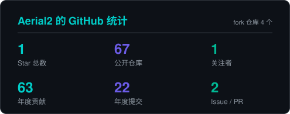
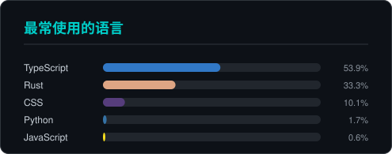
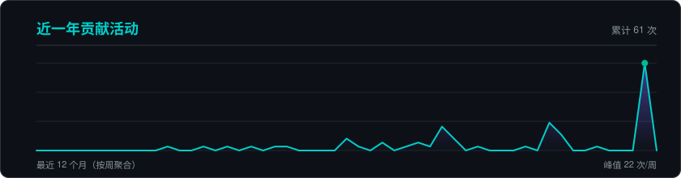

<!-- ==================== 顶部动效头图 ==================== -->

<!-- ==================== 打字机 ==================== -->

 

<!-- ==================== 徽章 ==================== -->

  
  
  

---

## 技术栈 · Tech Stack

**Languages**

**Frontend**

**Desktop & Backend**

**Infra & Tools**

---

## 数据面板 · GitHub Stats

 

 

---

## 贡献动画 · Contribution Arcade

<picture>
  <source media="(prefers-color-scheme: dark)" srcset="https://raw.githubusercontent.com/Aerial2/Aerial2/output/github-contribution-grid-snake-dark.svg" />
  <source media="(prefers-color-scheme: light)" srcset="https://raw.githubusercontent.com/Aerial2/Aerial2/output/github-contribution-grid-snake.svg" />
  
</picture>

 

<picture>
  <source media="(prefers-color-scheme: dark)" srcset="https://raw.githubusercontent.com/Aerial2/Aerial2/output/pacman-contribution-graph-dark.svg" />
  <source media="(prefers-color-scheme: light)" srcset="https://raw.githubusercontent.com/Aerial2/Aerial2/output/pacman-contribution-graph.svg" />
  
</picture>

---

## 终端夜航 · 文字冒险

点击开始游戏（纯 Markdown 实现，共 6 个结局）

 

> **凌晨 02:47。** 手机在床头震动。
>
> 监控群告警：核心支付链路的 5xx 率从 0.1% 飙到 37%，已经持续四分钟。
> 你摸黑打开电脑，PandaTerm 的连接列表静静躺在屏幕中央。
>
> 现在，**先做什么？**

一、打开监控面板，先看清状况

> 你切到监控页签。CPU 正常，内存正常，磁盘正常。
> 但下游一个叫 `payment-gateway` 的依赖，超时曲线几乎垂直向上。
>
> 你想起上周刚给它升过版本。

1-A　立刻回滚 payment-gateway

> 你翻出发布记录，找到上一个稳定版本，按下回滚。
>
> 90 秒后，5xx 曲线开始回落。3 分钟后归零。
>
> **【教科书式回滚】** 先定位、再动手，全程六分钟。
> 第二天的故障报告只有三行，队长在群里发了句「稳」。

1-B　先抓一份现场日志，再决定

> 你切到 SSH 会话，`tail -f` 盯上日志，同时用 SFTP 把最近十分钟的错误日志拖回本地。
> 满屏的 `connection reset by peer`。
>
> 你盯着日志看了八分钟，一直没敢动手。
>
> **【严谨但缓慢】** 你保留了完整现场，复盘时队友很感激。
> 但那八分钟里，又多了两万笔失败订单。

二、直接 SSH 上机器

> 你选中那台网关机，回车。终端亮起。
>
> `top` 一看：负载 40。进程列表里有个东西吃了 32 个核。
> 名字很眼熟 —— `backup-agent`。

2-A　手起刀落，直接 kill -9

> 负载应声而降。你松了口气，关掉终端回去睡觉。
>
> ……但 `backup-agent` 正在写的那份数据库快照变成了半截文件。
> 两周后的恢复演练上，你们才发现这件事。
>
> **【快但留坑】** 你灭了眼前的火，埋下一颗两周后才爆的雷。

2-B　先看清它在干什么，再决定

> 你用 PandaTerm 的进程面板点开它的启动参数：
> 每天 02:00 全量备份，没有限速。
>
> 你 `renice` 降低它的优先级，又给配置补上一行限速。
> 负载在五分钟内回到正常水位。
>
> **【治本】** 你没杀任何进程，但这个问题不会再来了。
> 次周复盘会上，这条被写进了团队最佳实践。

三、先翻昨天的发布记录

> 你打开昨天的变更清单。一共四项，其中一项把 `payment-gateway`
> 的连接池从 200 改成了 20，备注写着「降低资源占用」。

3-A　立刻改回 200，重新发布

> 你改配置、提交、等 CI 跑完。十一分钟后新版本上线，5xx 开始下降。
>
> **【定位精准】** 你只花一分钟就找到了根因，剩下的时间都在等流水线。
> 有人提议：这种配置项下次应该做成热更新。

3-B　先确认这个变更和故障是否真的相关

> 你对了两个时间点：变更发布于 18:20，故障始于 02:43 —— 中间隔了八个多小时。
>
> 相关性存疑。你回到监控页，发现真正的问题在下游数据库的慢查询上。
>
> **【差点误判】** 你抵住了「最后动过什么就怪什么」的诱惑。
> 凌晨 03:20，慢查询加上索引，故障解除。

 

---

> 六个结局，你抽到了哪一个？
>
> 这个游戏只用 `
` 标签的嵌套折叠实现 —— GitHub 的 markdown
> 会剥掉脚本、样式和事件，只留下这一个可点击的元素。

---

### 保持折腾，保持热爱

> *"Tools should get out of your way — and AI should earn your trust."*

  

